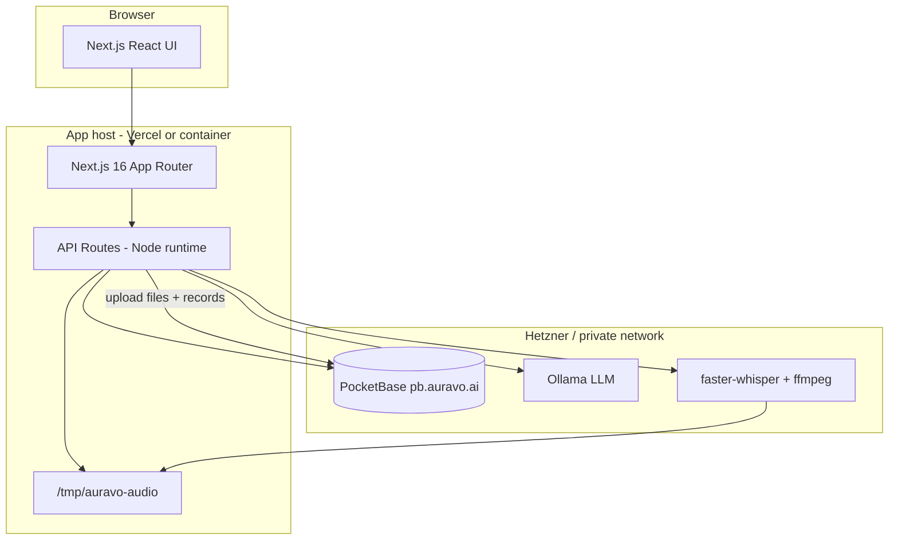

# Auravo Web — Design Document

## 1. Purpose

**auravo-web** is the browser-based client for Auravo: voice coaching for professional English (interviews, meetings, presentations, daily practice). It shares **accounts and data** with the Auravo mobile app via **PocketBase** at `https://pb.auravo.ai`.

This document describes architecture and design decisions. For setup steps see [INSTALLATION.md](./INSTALLATION.md).

---

## 2. System context



### Hostname roles

| Host | Role |
|------|------|
| `auravo.ai` | Marketing / landing (often Vercel) |
| `app.auravo.ai` / `auravo-web.auravo.ai` | Full product (this repo) |
| `pb.auravo.ai` | PocketBase API + admin (not end-user UI) |

---

## 3. Technology stack

| Layer | Choice |
|-------|--------|
| Framework | Next.js 16 (App Router, React 19) |
| Language | TypeScript |
| Styling | Tailwind CSS 4, Radix UI primitives |
| Auth & database | PocketBase (`users` + app collections) |
| Coach LLM | Ollama (HTTP, server-side only) |
| Transcription | Python faster-whisper (subprocess), ffmpeg |
| Validation | Zod |
| Tests | Vitest |

**Removed (legacy):** local SQLite (`better-sqlite3`), anonymous `auravo_user_id` cookie minting, `./data` persistence on the app server.

---

## 4. Application structure

```
app/
  page.tsx              # Public landing
  login/, signup/       # PocketBase auth
  (app)/                # Authenticated shell (AppChrome)
    dashboard/
    assessment/
    practice/
    simulations/
    meeting-prep/
    progress/
    settings/
    wordle/
  api/                  # Server routes (multipart, analysis, auth)
src/
  lib/pocketbase/       # Client + server PB helpers
  lib/analysis/         # Canonical runAnalysis pipeline
  lib/coach/            # Ollama + fallbacks
  lib/transcription/    # Whisper / placeholder
  db/queries/           # PocketBase data access
  components/           # UI
middleware.ts           # Auth gate → /login
```

### Protected routes

Middleware checks the `pb_auth` cookie. Unauthenticated users hitting `/dashboard`, `/assessment`, `/practice`, etc. are redirected to `/login?redirect=...`.

---

## 5. Authentication design

- **Collection:** existing PocketBase `users` (shared with mobile). No second users table.
- **Email/password:** `POST /api/auth/login`, `POST /api/auth/signup` → `pb_auth` httpOnly cookie.
- **Google OAuth2:** `/api/auth/oauth2/start` → Google → `/api/auth/oauth2/callback` → cookie.
- **Display name:** from `display_name`, `name`, or email local-part (see `getAuthUserDisplayName`).

Logout clears `pb_auth` via `POST /api/auth/logout`.

---

## 6. Data model (PocketBase)

All durable state lives in PocketBase. See [POCKETBASE.md](./POCKETBASE.md) for collection schemas and CORS.

| Collection | Purpose |
|------------|---------|
| `users` | Auth + profile (`display_name`, `onboarding_goal_id`) |
| `practice_sessions` | Session metadata + `audio` file |
| `session_scores` | Six dimension scores per session |
| `session_transcripts` | Transcript + `analysis_json` |
| `onboarding_baselines` | User → baseline session link |
| `baseline_segments` | Multi-part assessment drafts |
| `simulation_turns` | Per-turn simulation audio/text |
| `baseline_handoffs` | One-shot post-assessment cookie handoff |

**API rules:** rows scoped to `@request.auth.id` (or relation to user).

---

## 7. Audio and analysis pipeline

1. Browser uploads audio (multipart) to an API route.
2. Server writes blob to **`/tmp/auravo-audio/{id}.webm`** (ephemeral).
3. **`runAnalysis`** runs: transcription → scoring → optional Ollama coach summary.
4. Results + audio file uploaded to PocketBase.
5. Temp files are not the source of truth; replay uses PocketBase file URLs.

This design supports **Vercel serverless** (no local disk DB) and **containers** (same temp pattern).

---

## 8. Coach / LLM behavior

- **Primary:** Ollama at `OLLAMA_BASE_URL` (default `http://127.0.0.1:11434`), model `OLLAMA_MODEL` (default `qwen2.5:3b`).
- **Fallback:** deterministic copy in `src/lib/coach/fallbacks.ts` when Ollama is down or times out.
- **Timeout:** `AURAVO_COACH_TIMEOUT_MS` (default 120s).

Ollama is **not** embedded in PocketBase; it must be reachable from wherever API routes execute.

---

## 9. Deployment topologies

### A. Vercel (frontend + serverless API)

- **Good for:** UI, auth, PocketBase CRUD.
- **Limitation:** No long-lived local disk; transcription/Ollama need external URLs or accept placeholder transcription.
- **Build:** `npm ci` + `npm run build`; commit synced `package-lock.json`.
- **Deploy hygiene:** if Vercel reports `npm ci` lockfile mismatch for an unchanged commit, redeploy with build cache disabled once.

### B. Container on Debian (Podman/Docker) + nginx + Cloudflare

- **Good for:** Full stack on one VPS (with PocketBase + Ollama + Whisper on same or linked hosts).
- **Pattern:** `auravo-web` container `127.0.0.1:3001→3000`, nginx `router` proxies `auravo-web.auravo.ai` → upstream.

### C. Split (recommended production)

| Service | Host |
|---------|------|
| Next app | Vercel or `app.auravo.ai` |
| PocketBase | `pb.auravo.ai` (Hetzner) |
| Ollama + Whisper | Hetzner private IP / same VPS |

---

## 10. Security notes

- `NEXT_PUBLIC_*` vars are exposed to the browser; only put non-secrets there (e.g. PocketBase public URL).
- PocketBase admin must configure **allowed origins** for every app hostname.
- Google OAuth redirect URIs must match each deployment host (`/api/auth/oauth2/callback`).
- API routes use `requireApiUserId()`; no anonymous session minting.

---

## 11. Key user flows

| Flow | Entry | Persistence |
|------|-------|-------------|
| Sign in | `/login` | `pb_auth` |
| Initial assessment | `/assessment` | `baseline_segments` → finalize → `practice_sessions` |
| Daily practice | `/practice/today` | `practice_sessions` + scores/transcript |
| Simulation | `/simulations` | `simulation_turns`, draft → finalize |
| Meeting prep | `/meeting-prep` | Same session model |
| Progress | `/progress` | Read-only aggregates from PB |
| Wordle | `/wordle` | Client-side / optional PB (no heavy audio) |

---

## 12. Related documents

- [INSTALLATION.md](./INSTALLATION.md)
- [POCKETBASE.md](./POCKETBASE.md)
- [TROUBLESHOOTING.md](./TROUBLESHOOTING.md)
